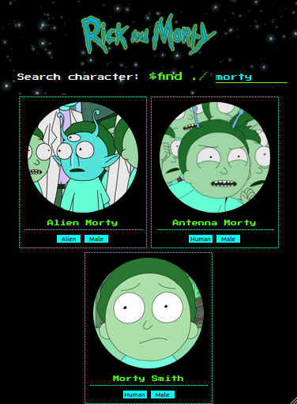
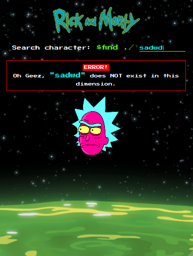
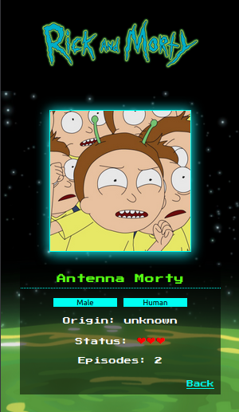
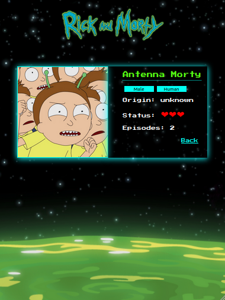

## 👽Rick & Morty Character's DB👽

This project is part of Adalab's coursework evaluation 💻

### 🛠Main Tools

**React.js** - **Javascript** - **CSS3/SASS** - **HTML5**

### 💾What does this project do?

You can filter the list by typing a character's name on the input field:

You will get an error message if you type a non existing character:

### 🎨Responsive Design

📱**Mobile**

📱💻**Tablet/PC**

